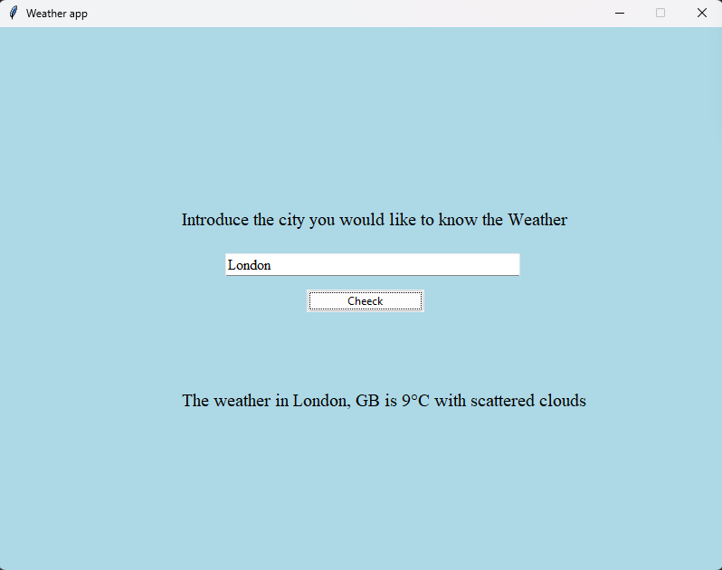

# Weather App 🌤️

This is a simple graphical weather application built with **Python** using **Tkinter** for the GUI and **OpenWeatherMap API** for real-time weather data.

## Features

- 🌍 Get current weather by entering the city name
- 🌡️ Displays temperature in Celsius
- 🌧️ Includes a short description of current weather conditions
- 🖼️ Simple and clean graphical user interface

## Preview



## Requirements

- Python 3
- [Requests](https://pypi.org/project/requests/)
- Tkinter (comes pre-installed with Python)

## How to Run

1. Clone the repository or download the script:

```bash
git clone https://github.com/yourusername/weather-app.git
```

2. Install the required Python packages (if not already installed)
```
pip install requests
```
3. Run the app

```
python weather_app.py
```

## Configuration
This app uses the OpenWeatherMap API.

To use it:

1.  Create a free account at OpenWeatherMap.

2. et your API key.

3. Replace the following line in the code with your own API key:

```
API_key = "your_api_key_here"
```

## Notes
- The temperature is shown in Celsius (units=metric).

- Make sure you're connected to the internet when using the app.

## To Do
- Add icons based on weather conditions ☁️

- Support more languages 🌐

- Add forecast feature (next 3–5 days)